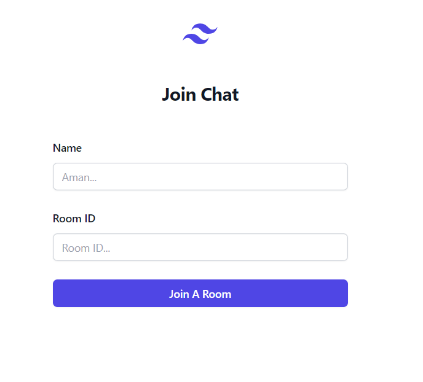
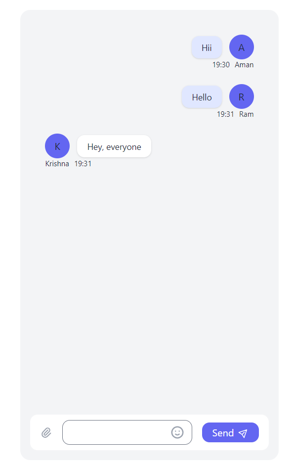

# To run the Chat_app, follow these steps:

### Clone the Repository:

* Create a folder in your local machine where you want to clone the repo.
* Then open teminal inside that folder.
* Use git clone to copy the repository to your local machine
  > git clone https://github.com/Amank7501/Chat_app.git

### Install Dependencies:
Navigate into the cloned directory and install the necessary dependencies for both the frontend and backend components.

* Inside the cloned directory(i.e. Chat_app) run
  > npm i
* Then navigate to frontend directory
  > cd .\frontend\ 
* Inside the frontend directory run
  >npm i 

### Start the Backend Server:
Navigate to the cloned directory after installing dependencies in the frontend and backend components and start the backend server.

* Inside the cloned directory (i.e. Chat_app) run
  > npm start
* Now our server is running.

### Start the Frontend Server:
Navigate to the frontend directory of the project and start the frontend server.

* Inside the frontend directory run
  > npm start
* Now our frontend is running.

### Access the Application:
Once both the backend and frontend servers are up and running, you should be able to access the chat application via a web browser.
Open the browser and type the below URL.
> http://localhost:3000

# How to use chat app running in the browser

### Join a Chat Room:

* Open the main join chat page in your web browser.
* Enter your Name and a Room ID of your choice.
* Click on "Join A Room" to proceed.

  
### Chatting:

* Once you've joined a room, you will be directed to the chat room interface.
* Users with the same Room ID can interact with each other by sending messages.

### Multiple Users and Tabs:

* Users with the same Room ID can chat with each other.
* You can open multiple tabs in the browser and join the same room with different names to simulate multiple users in the same chat room.

  
### Example:
## User 1:
> Name: Aman,
> Room ID: Room123

### User 2:
> Name: Ram,
> Room ID: Room123

### User 3:
> Name: Krishna,
> Room ID: Room123

Now Aman, Ram and Krishna can chat with each other because they are in the same room (Room123).

### Features:
  * Unique Rooms:
  * Users with different Room IDs will not be able to chat with each other.

## Multiple Rooms:
  * Create multiple chat rooms by using different Room IDs.
  * User-friendly Interface:Simple and easy-to-use interface for a seamless chatting experience.
